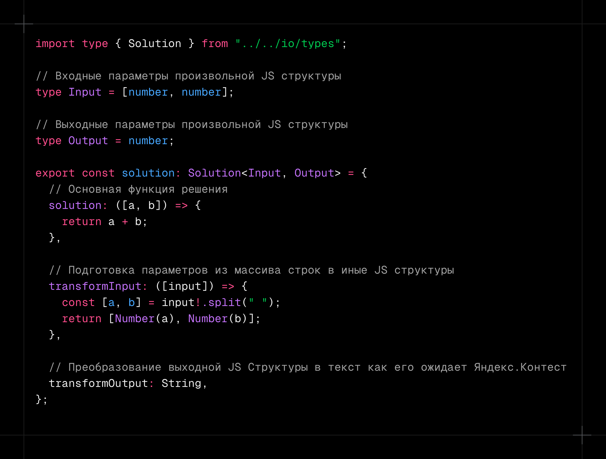
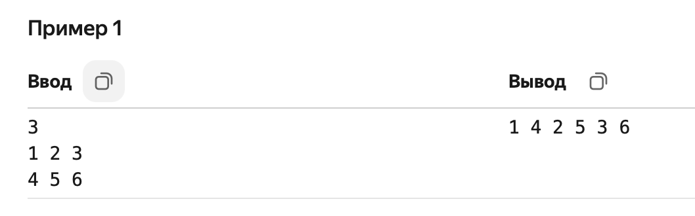

# yandex-contest-typescript-runner

`yandex-contest-typescript-runner` — инструмент, который приближает Developer Experience (DX) использования [Яндекс.Контеста](https://contest.yandex.ru/) к удобству платформ вроде [LeetCode](https://leetcode.com). Он позволяет писать решения на TypeScript, быстро создавать, тестировать и собирать готовый к запуску на платформе JS-файл, предоставляя абстракцию над операциями чтения и записи данных.



## Структура файла решения (`solution`)

Каждое решение оформляется как TypeScript-модуль, который экспортирует объект `solution` с типом `Solution<Input, Output>`.

### Поля объекта `solution`

| Поле              | Тип                             | Описание                                                                                                                           |
| ----------------- | ------------------------------- | ---------------------------------------------------------------------------------------------------------------------------------- |
| `solution`        | `(args: Input) => Output`       | Основная функция решения. Получает уже обработанные входные данные и возвращает результат.                                         |
| `transformInput`  | `(rawInput: string[]) => Input` | Функция преобразования сырого ввода (массив строк) в тип `Input`. Используется для подготовки данных перед передачей в `solution`. |
| `transformOutput` | `(output: Output) => string`    | Функция форматирования результата решения в строку, готовую к выводу или записи в файл.                                            |

## Тестирование

Запуск тестов осуществляется командой:

```bash
npm run solution:test <testPath>
```

| Параметр   | Описание                                                                                      | Значение по умолчанию     |
| ---------- | --------------------------------------------------------------------------------------------- | ------------------------- |
| `testPath` | Путь до файла с тестами или taskId (например: `example` или `./src/example/solution.test.ts`) | **обязательный аргумент** |

### Использование готовых тесткейсов

Также есть возможность протестировать решение полным циклом, начиная от парсинга данных, заканчивая постобработкой в нужный по требованиям задачи формат, проходя следующую цепочку преобразований: `plainInput->rawInput->input->output->rawOutput`



#### Тестирование через std

Скопированный из Яндекс.Контеста ввод/вывод необходимо поместить в обратные кавычки (\`\`), соблюдая при этом нулевую табуляцию - без этого работать не будет.

```ts
import { solution } from "./solution.ts";
import { runSolution } from "../../io/utils.ts";

describe("Solution", () => {
  it("Run from std", () => {
    const plainInput = `3
1 2 3
4 5 6`;
    const expectedOutput = `1 4 2 5 3 6`;

    const output = runSolution(solution, plainInput);

    expect(output).toBe(expectedOutput);
  });
});
```

#### Тестирование через файлы input.txt/output.txt

Скопированный из Яндекс.Контеста ввод/вывод необходимо поместить в два произвольных файла внутри директории, где находится тест, по умолчанию - это файлы `input.txt` и `output.txt`

```ts
import { solution } from "./solution.ts";
import { runSolution } from "../../io/utils.ts";
import { getPlainTextFromFile } from "../../runner/utils.ts";

describe("Solution", () => {
  it("Run from file", () => {
    const plainInput = await getPlainTextFromFile("input.txt", __dirname);
    const expectedOutput = await getPlainTextFromFile("output.txt", __dirname);

    const output = runSolution(solution, plainInput);

    expect(output).toBe(expectedOutput);
  });
});
```

## Сборка

```bash
npm run solution:build -- <solutionPath>
```

| Параметр                   | Описание                                                                                  | Значение по умолчанию     |
| -------------------------- | ----------------------------------------------------------------------------------------- | ------------------------- |
| `solutionPath`             | Путь до файла с решением или taskId (например: `example` или `./src/example/solution.ts`) | **обязательный аргумент** |
| `-r, --runner <type>`      | Тип раннера (`file` или `std`)                                                            | `file`                    |
| `-i, --input <path>`       | Путь до входного файла (для fileRunner)                                                   | `input.txt`               |
| `-o, --output <path>`      | Путь до выходного файла (для fileRunner)                                                  | `output.txt`              |
| `-O, --outfile <filename>` | Имя итогового JS-файла                                                                    | `<solutionName>.js`       |

## Быстрое создание новых задач

Для удобного старта работы с новой задачей можно использовать команду:

```bash
npm run solution:create <taskName>
```

| Параметр   | Описание                       | Значение по умолчанию     |
| ---------- | ------------------------------ | ------------------------- |
| `taskName` | Название директории для задачи | **обязательный аргумент** |

Команда автоматически создаёт директорию src/\<taskName> и копирует в неё все файлы из директории `_template`

Чтобы предотвратить коллизию в названиях директорий, можно именовать их из url к задаче контеста: `https://contest.yandex.ru/contest/26365/problems/B/` -> `26365-B`

## Примеры

Решение [ознакомительной задачи](https://contest.yandex.ru/contest/3/problems) из Яндекс.Контест'a

```
src/
└─ example/
   ├─ solution.ts               Решение задачи
   ├─ solution.test.ts          Тест задачи
   ├─ README.md                 Описание задачи
```

Команды для запуска сборки и тестирования

```bash
# Используя taskId
npm run solution:build -- example
npm run solution:test example

# Или используя относительный путь
npm run solution:build -- ./src/example/solution.ts
npm run solution:test ./src/example/solution.test.ts
```
