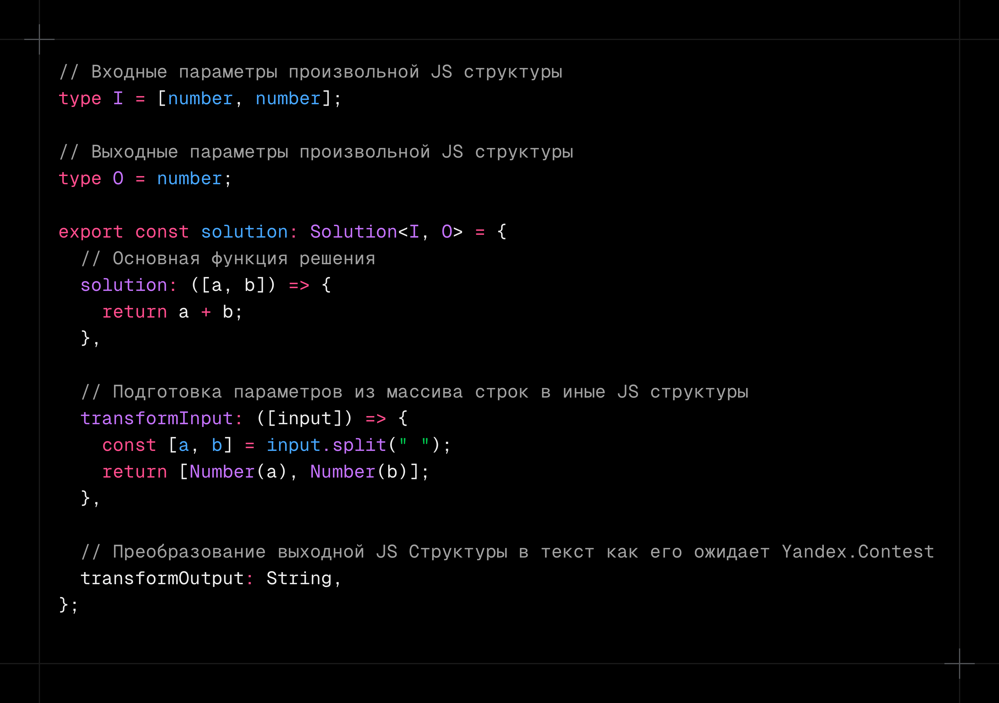

# yandex-contest-typescript-runner

`yandex-contest-typescript-runner` — инструмент, который приближает Developer Experience (DX) использования [Яндекс.Контеста](https://contest.yandex.ru/) к удобству платформ вроде [LeetCode](https://leetcode.com). Он позволяет писать решения на TypeScript, быстро создавать, тестировать и собирать готовый к запуску на платформе JS-файл, предоставляя абстракцию над операциями чтения и записи данных.



## Структура файла решения (`solution`)

Каждое решение оформляется как TypeScript-модуль, который экспортирует объект `solution` с типом `Solution<I, O>`.

### Поля объекта `solution`

| Поле              | Тип                         | Описание                                                                                                                       |
| ----------------- | --------------------------- | ------------------------------------------------------------------------------------------------------------------------------ |
| `solution`        | `(parsedInput: I) => O`     | Основная функция решения. Получает уже обработанные входные данные и возвращает результат.                                     |
| `transformInput`  | `(rawInput: string[]) => I` | Функция преобразования сырого ввода (массив строк) в тип `I`. Используется для подготовки данных перед передачей в `solution`. |
| `transformOutput` | `(output: O) => string`     | Функция форматирования результата решения в строку, готовую к выводу или записи в файл.                                        |

## Тестирование

Запуск тестов осуществляется командой:

```bash
npm run solution:test <solutionPath>
```

| Параметр       | Описание                 | Значение по умолчанию     |
| -------------- | ------------------------ | ------------------------- |
| `solutionPath` | Путь до файла с решением | **обязательный аргумент** |

- Тестирование не задействует read/write операции

## Сборка

```bash
npm run solution:build <solutionPath>
```

| Параметр                   | Описание                                 | Значение по умолчанию     |
| -------------------------- | ---------------------------------------- | ------------------------- |
| `solutionPath`             | Путь до файла с решением                 | **обязательный аргумент** |
| `-r, --runner <type>`      | Тип раннера (`file` или `std`)           | `file`                    |
| `-i, --input <path>`       | Путь до входного файла (для fileRunner)  | `input.txt`               |
| `-o, --output <path>`      | Путь до выходного файла (для fileRunner) | `output.txt`              |
| `-O, --outfile <filename>` | Имя итогового JS-файла                   | `<solutionName>.js`       |

## Быстрое создание новых задач

Для удобного старта работы с новой задачей можно использовать команду:

```bash
npm run solution:create <taskName>
```

| Параметр   | Описание                       | Значение по умолчанию     |
| ---------- | ------------------------------ | ------------------------- |
| `taskName` | Название директории для задачи | **обязательный аргумент** |

Команда автоматически создаёт директорию src/\<taskName> и копирует в неё все необходимые для решения файлы.

## Примеры

Решение [ознакомительной задачи](https://contest.yandex.ru/contest/3/problems) из Яндекс.Контест'a

```
src/
└─ example/
   ├─ solution.ts               Решение задачи
   ├─ solution.test.ts          Тест задачи
   ├─ README.md                 Описание задачи
```

Команды для запуска сборки и тестирования

```bash
npm run solution:build ./src/example/solution.ts
npm run solution:test ./src/example/solution.ts
```
